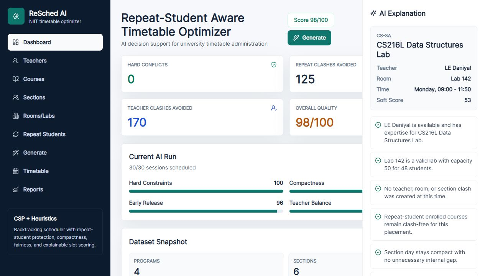

# ReSched AI

**Repeat-Student Aware University Timetable Optimizer**

ReSched AI is a web-based AI scheduling system for NIIT-style university timetable generation. It is not only a timetable display screen; it models scheduling as a **Constraint Satisfaction Problem (CSP)** and improves valid timetables using **backtracking, heuristic ordering, soft-constraint scoring, and explainable AI**.



## Quick Start

Anyone can clone and run the project locally. The SQLite database is created automatically on first run from the included seed data.

Requirements:

- Python 3.10 or newer
- Internet connection for first-time package install

```powershell
git clone https://github.com/AliUmarxp/ReSched-AI.git
cd ReSched-AI
.\RUN_PROJECT.ps1
```

Open:

```text
http://127.0.0.1:8002
```

Demo login:

```text
admin / admin123
```

## Search Keywords

This repository is useful for students searching for:

- Artificial Intelligence CCP project
- AI lab project in Python
- university timetable generator
- university schedule optimizer
- automatic timetable generation system
- CSP timetable scheduling
- constraint satisfaction problem project
- backtracking scheduling project
- heuristic search AI project
- explainable AI scheduling system
- FastAPI React timetable project
- SQLite timetable management system
- repeat-student aware timetable optimizer

## Why This Project Is Different

Most basic timetable generators only check common conflicts such as teacher, room, or section clashes. ReSched AI adds academic rules and fairness logic that are closer to real university scheduling.

| Area | Basic Timetable Generator | ReSched AI |
|---|---|---|
| Teacher clash | Usually supported | Supported as a hard constraint |
| Room/lab clash | Usually supported | Supported with room type and capacity checks |
| Lab handling | Often partial | Labs stay as one continuous 3-hour block |
| Credit-hour logic | Often generic | 3-credit theory uses 2+1 weekly split |
| Same course teacher | Often flexible/random | Same section-course keeps the same teacher all week |
| Repeat students | Rarely handled directly | Repeat-student clash protection is part of the model |
| Student gaps | Often ignored | Compact timetable and gap control scoring |
| Fairness | Usually minimal | Day fairness and early-release scoring |
| Explainability | Usually absent | Each slot has an AI explanation panel |
| Exports | Sometimes CSV only | CSV, PDF, and per-section PDF ZIP |

## Core Features

- Admin login flow
- Dashboard with scheduler score, conflict count, and dataset summary
- Teachers module with expertise and availability matrix
- Courses module with type, credit hours, contact hours, difficulty, and allowed teachers
- Sections module with strength and required courses
- Section Subject Plan page showing which section studies which courses
- Rooms/Labs module with type and capacity
- Repeat-student model for repeated-course clash protection
- Generate timetable with AI scheduling engine
- Section-wise, teacher-wise, room-wise, and lab-wise timetable views
- Conflict report with avoided clashes and warnings
- AI explanation panel for every scheduled class
- CSV, full PDF, and section-wise PDF ZIP export
- Final CCP report and presentation included

## AI Concepts Used

| AI Concept | How It Is Used |
|---|---|
| Constraint Satisfaction Problem | Sessions are variables; teachers, rooms, labs, and time slots are domains; academic rules are constraints. |
| DFS / Backtracking | The scheduler can backtrack when later assignments become impossible. |
| Heuristic Ordering | Labs, scarce teachers, repeat-sensitive sessions, and longer sessions are scheduled earlier. |
| Soft Optimization | Valid schedules are scored for compactness, early release, teacher balance, day fairness, and lab quality. |
| Knowledge Representation | Teachers, courses, sections, rooms, repeat students, and time slots are represented as structured entities. |
| Explainable AI | Each scheduled slot stores human-readable reasons for why that slot was selected. |
| Adaptive Scoring | The AI profile updates weights after a run based on weak quality areas. |

## Scheduling Rules

### Hard Constraints

These rules must not break:

- A teacher cannot teach two classes at the same time.
- A room or lab cannot be double-booked.
- A section cannot attend two classes at the same time.
- Lab courses must be assigned to lab rooms.
- Theory courses must be assigned to classrooms.
- Room capacity must be enough for section strength.
- Teacher must be available and eligible for the course.
- Same section-course keeps the same teacher across weekly lectures.
- Labs are scheduled as one continuous 3-hour block.
- 3-credit theory courses use a 2-hour block plus a 1-hour lecture on another day.
- Same section-course lectures are spread across different days.
- Friday prayer buffer and midday break crossing are protected.

### Soft Constraints

These rules improve quality when multiple valid choices exist:

- Minimize section gaps.
- Prefer early release for students.
- Balance teacher workload across days.
- Avoid too many consecutive lectures.
- Prefer difficult courses earlier in the day.
- Keep section days compact.
- Improve fairness after late days.

## AI Scheduling Flow

```text
Load dataset
  -> Build required class sessions
  -> Sort by most constrained first
  -> Generate teacher-room-time candidates
  -> Reject hard constraint violations
  -> Score valid candidates
  -> Assign best candidate
  -> Backtrack if needed
  -> Save timetable, report, quality score, and explanations
```

## Current Demo Result

Using the cleaned SECTION-WISE demo dataset:

| Metric | Result |
|---|---:|
| Weekly sessions scheduled | 149 / 149 |
| Unscheduled sessions | 0 |
| Hard conflicts | 0 |
| Overall quality score | 85 / 100 |
| Hard constraint score | 100 / 100 |
| Compactness score | 96 / 100 |
| Lab quality score | 96 / 100 |
| Repeat protection score | 100 / 100 |

## Tech Stack

| Layer | Technology |
|---|---|
| Frontend | React, CSS, Lucide icons |
| Backend | Python FastAPI |
| Database | SQLite |
| AI Engine | Custom Python CSP/backtracking/heuristic scheduler |
| Export | ReportLab PDF, CSV, ZIP |
| Dataset | Cleaned NIIT-style SECTION-WISE JSON/CSV seed data |

## Project Structure

```text
ReSched-AI/
├── backend/
│   ├── main.py                  # FastAPI routes and exports
│   ├── scheduler.py             # AI scheduling engine
│   ├── sectionwise_importer.py  # SECTION-WISE data extraction
│   ├── seed_data.py             # Included demo dataset
│   └── store.py                 # SQLite storage helpers
├── static/
│   ├── app.jsx                  # React app
│   ├── index.html
│   └── styles.css
├── data/
│   ├── section-wise-extracted-data.json
│   └── section-wise-course-rows.csv
├── docs/
│   ├── final-dashboard-screenshot.png
│   └── section-wise-extraction.md
├── presentation pptx and report word file/
│   ├── ReSched_AI_CCP_Final_Presentation.pptx
│   └── ReSched_AI_CCP_Project_Report.docx
├── RUN_PROJECT.ps1
├── requirements.txt
├── TODO.txt
├── LICENSE
└── README.md
```

## API and Export Endpoints

| Endpoint | Purpose |
|---|---|
| `/api/data` | Load dataset and latest run |
| `/api/generate` | Generate timetable |
| `/api/import/section-wise` | Import local SECTION-WISE files if available |
| `/api/rooms/free` | Check free rooms for a day/slot |
| `/api/export/timetable.csv` | Export timetable as CSV |
| `/api/export/timetable.pdf` | Export complete timetable as PDF |
| `/api/export/section-pdfs.zip` | Export per-section PDF files in a ZIP |

## Included Deliverables

- Source code
- Cleaned demo dataset
- Final CCP Word report
- Final CCP PowerPoint presentation
- Dashboard screenshot
- MIT license
- One-command local run script

## Data and Privacy Note

Raw SECTION-WISE DOCX import files and the local SQLite database are intentionally not committed. They may contain institution-specific academic records or local runtime state. The repository includes cleaned JSON/CSV seed data so the project can still run after a fresh clone.

Generated local files ignored by Git:

- `.venv/`
- `__pycache__/`
- `data/*.sqlite3`
- generated timetable ZIP files
- raw `imports/` documents

## License

This project is released under the MIT License. See [LICENSE](LICENSE).
